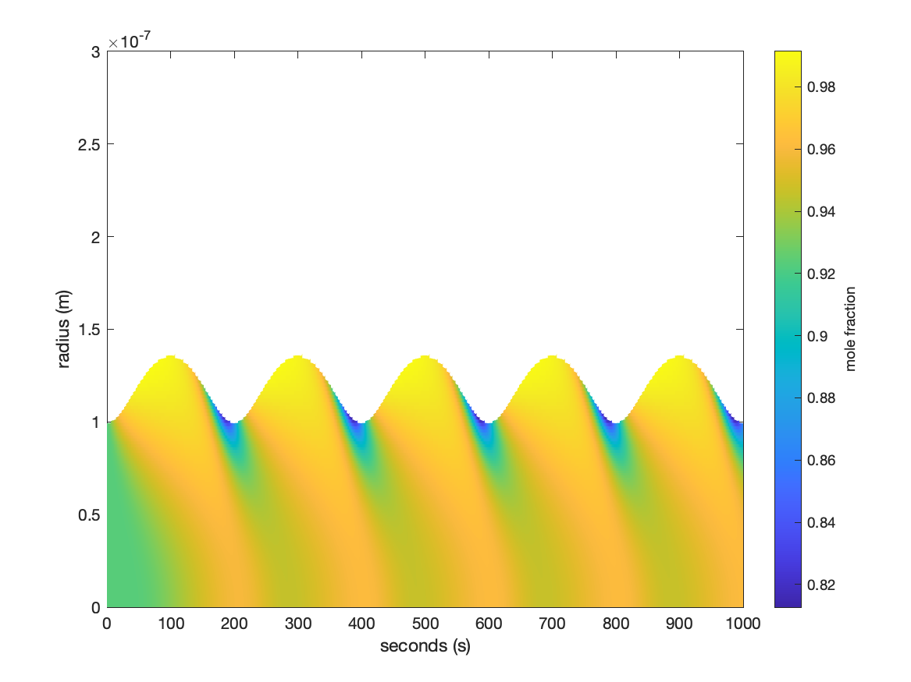

# Moving Boundary Diffusion (MBD)

This directory contains a small Fortran model for solving **radial Fickian diffusion inside a spherical particle whose outer boundary can move with time**. It is intended to be usable both as a standalone demonstration program and as a subtree embedded in a larger model.

The code tracks two dissolved components on a radial grid:

1. **water**, and
2. **solute**.

As the particle grows or shrinks, the outer radius and active radial grid are adjusted and the component inventories are remapped onto the new spherical shells. Diffusion then redistributes the two components within the particle.

The public routine argument lists have deliberately been kept unchanged so that the subtree can continue to be called by an existing host model.

## Example

The supplied standalone example produces the following moving-boundary calculation:



The horizontal axis is time and the vertical axis is radial position within the particle. The colour shows the **water mole fraction**

$$
x_w = \frac{c_w}{c_w+c_s},
$$

where `c_w` is the molar concentration of water and `c_s` is the molar concentration of solute.

The example starts with a particle radius of **100 nm**. A sinusoidal water-volume tendency is then imposed with a period of **200 s**, so the particle repeatedly grows to approximately **136 nm** and then shrinks back toward its original size. The 1000 s simulation therefore contains five complete growth/shrink cycles.

During growth, newly added material at the moving outer boundary is water-rich. Diffusion acts to smooth this compositional perturbation into the particle interior. During shrinkage, water is removed from the outer part of the particle and the remaining solute is moved inward consistently with the new boundary position. The narrow lower-water-fraction regions visible close to the contracting boundary are the transient composition gradients produced by this process.

The example is intentionally simple: it is primarily a test of the moving radial boundary, component remapping and internal diffusion rather than a complete aerosol thermodynamic model.

## What the model solves

For each component, the diffusion calculation is based on the spherically symmetric form of Fick's law,

$$
\frac{\partial c}{\partial t}
=
\frac{1}{r^2}
\frac{\partial}{\partial r}
\left(
 r^2 D \frac{\partial c}{\partial r}
\right),
$$

where:

- `c` is molar concentration in each spherical shell,
- `r` is radial position, and
- `D` is the diffusion coefficient.

`backward_euler` advances this equation implicitly using a tridiagonal solve. The discretisation uses the exact spherical shell volume, giving a conservative finite-volume treatment when the boundary flux is zero.

The standalone demonstration uses zero diffusive flux at the centre and at the current particle boundary. Motion of the particle surface is handled separately by `move_boundary`.

## Moving boundary

`move_boundary` receives a volume increment `deltaV` for the current timestep.

### Growth: `deltaV > 0`

The particle radius is increased according to the additional volume. Water is added to the outer region, the number of active radial shells is updated where necessary, and the outer composition is redistributed over any newly occupied shells. The radial grid is then rebuilt so that the final active half-level coincides with the new particle radius.

### Shrinkage: `deltaV < 0`

Water is removed starting from the outermost occupied shells. Any solute in shells that disappear as the particle contracts is moved inward, and the new outer shell is reconstructed from the remaining water and solute volumes. The scalar particle radius and the moving grid boundary are updated together.

The full logarithmic reference grid remains fixed between `rad_min` and `rad_max`; only the number of currently occupied shells and the position of the final occupied boundary change.

## Radial grid

The model constructs a logarithmically spaced radial reference grid between

- `rad_min`, and
- `rad_max`.

`kp` specifies the total number of radial intervals available on this reference grid. `kp_cur` identifies the current outer occupied shell associated with the instantaneous particle radius.

The main grid arrays are:

| Variable | Meaning |
| --- | --- |
| `r` | radial cell-centre positions |
| `r05` | radial cell-face / half-level positions |
| `dr` | centre-to-centre radial spacing |
| `dr05` | half-level spacing |
| `vol` | exact volume of each spherical shell |
| `c(:,1)` | water molar concentration |
| `c(:,2)` | solute molar concentration |
| `d`, `d05` | diffusion coefficient at grid levels and faces |
| `u` | boundary/grid velocity storage retained for interface compatibility |

## Initial composition

The standalone initialization fills the particle with a uniform water/solute mixture determined by `rh`, `nu`, the component molecular weights and densities.

For each shell the initial water and solute mole numbers are formed using

$$
n_s = \frac{1-RH}{RH\,\nu} n_w.
$$

Consequently, `rh` is being used here to define the initial solution composition through this idealised activity relation. It is **not** currently coupled to an external gas-phase mass-transfer calculation in the standalone driver.

The relevant physical constants/inputs are:

- water density: `1000 kg m^-3` (internal constant),
- water molecular weight: `18e-3 kg mol^-1` (internal constant),
- solute molecular weight: `mwsol`,
- solute density: `rhosol`, and
- van't Hoff factor: `nu`.

## Standalone demonstration forcing

The moving boundary used for the example figure is controlled through the namelist. No public subroutine interface was changed to add this demonstration forcing.

For `forcing_mode = 1`, the driver uses

$$
\frac{dV}{dt}
=
A\sin\left(\frac{2\pi t}{P}\right),
$$

where

- `A = forcing_dvdt_amplitude`, and
- `P = forcing_period`.

The actual volume change passed to `move_boundary` is this tendency multiplied by the current timestep. Expressing the forcing as `dV/dt` avoids changing the physical forcing amplitude when `dt` is changed.

Set

```fortran
nmd%forcing_mode = 0
```

when the moving boundary is controlled by the parent model rather than by the standalone example.

## Example namelist

The supplied `namelist.in` is configured to reproduce the example figure:

```fortran
&run_vars
    nmd%outputfile = 'output.nc',

    nmd%kp      = 1000,
    nmd%rad     = 100.e-9,
    nmd%rad_min = 1.e-9,
    nmd%rad_max = 5.e-2,

    nmd%runtime = 1000.,
    nmd%dt      = 1.,

    nmd%t       = 298.,
    nmd%p       = 100000.,
    nmd%rh      = 0.8,
    nmd%mwsol   = 200.e-3,
    nmd%rhosol  = 1500.,
    nmd%nu      = 3.,
    nmd%d_coeff = 1.e-17,

    nmd%forcing_mode           = 1,
    nmd%forcing_period         = 200.,
    nmd%forcing_dvdt_amplitude = 1.e-22,
/
```

### Namelist variables

| Variable | Units | Description |
| --- | --- | --- |
| `outputfile` | - | NetCDF output filename |
| `kp` | - | number of radial grid intervals |
| `rad` | m | initial particle radius |
| `rad_min` | m | lower bound of logarithmic reference grid |
| `rad_max` | m | upper bound of logarithmic reference grid |
| `runtime` | s | total integration time |
| `dt` | s | model timestep |
| `t` | K | temperature retained for the host-model interface |
| `p` | Pa | pressure retained for the host-model interface |
| `rh` | - | relative humidity/activity parameter used to initialise composition |
| `mwsol` | kg mol^-1 | solute molecular weight |
| `rhosol` | kg m^-3 | solute density |
| `nu` | - | van't Hoff factor used in initial composition |
| `d_coeff` | m^2 s^-1 | internal diffusion coefficient |
| `forcing_mode` | - | `0`: no standalone boundary forcing; `1`: sinusoidal volume tendency |
| `forcing_period` | s | period of the sinusoidal demonstration forcing |
| `forcing_dvdt_amplitude` | m^3 s^-1 | amplitude of the imposed particle-volume tendency |

## Building

The standalone program requires the NetCDF Fortran library.

The Makefile expects the following variables to identify the NetCDF installation:

```make
NETCDF_FOR=...
NETCDF_C=...
NETCDF_LIB=-lnetcdff
```

These may be set directly in the Makefile or exported as environment variables.

On a system with separate NetCDF C and Fortran installations, point `NETCDF_C` and `NETCDF_FOR` at the appropriate prefixes and normally use

```make
NETCDF_LIB=-lnetcdff
```

If the installation exposes the required interfaces from a single prefix, `NETCDF_C` and `NETCDF_FOR` can be the same.

Compile with

```bash
make
```

This builds the numerical support library under `osnf/` and then creates

```text
main.exe
```

in the subtree root.

## Running

Run the supplied example with

```bash
./main.exe namelist.in
```

If no command-line namelist filename is supplied, `main.exe` defaults to

```text
namelist.in
```

The example writes

```text
output.nc
```

in the working directory.

## NetCDF output

The standalone driver writes the following variables:

| NetCDF variable | Dimensions | Units | Description |
| --- | --- | --- | --- |
| `time` | `times` | s | model time |
| `radius` | `times` | m | instantaneous particle outer radius |
| `c` | `kp, ncomp, times` | mol m^-3 | component concentrations; component 1 is water and component 2 is solute |
| `r` | `kp, times` | m | radial cell-centre positions |
| `vol` | `kp, times` | m^3 | spherical shell volumes |

The inactive part of the radial grid outside the instantaneous particle boundary has zero component concentration.

## Reproducing the example image in MATLAB

The plotting script is

```text
matlab/plot_moving_boundary_diffusion.m
```

From MATLAB, run

```matlab
plot_moving_boundary_diffusion
```

The script is independent of MATLAB's current working directory. It:

1. finds the subtree root relative to its own location;
2. runs `main.exe` with the supplied `namelist.in`;
3. reads the resulting root-level `output.nc`;
4. calculates the water mole fraction from the two concentration components; and
5. overwrites

```text
matlab/images/moving_boundary_diffusion.png
```

with the newly generated figure.

The checked-in image therefore acts both as a visual example and as a simple regression target for the standalone calculation.

## Public interface / use as a subtree

The main routines exposed by module `diffusion` are:

| Routine | Purpose |
| --- | --- |
| `allocate_and_set_diff` | allocate the radial arrays, construct the initial grid and initialise composition |
| `move_boundary` | grow or shrink the spherical particle and conservatively remap water/solute inventories |
| `backward_euler` | advance radial diffusion by one implicit timestep |
| `diffusion_driver` | standalone time loop combining forcing, boundary movement, diffusion and NetCDF output |

The module also exposes `grid`, `gridd`, `nmd` and `iod` as in the existing interface.

The argument lists of the public routines have been retained so this subtree can continue to sit inside a larger model without requiring corresponding host-model call-site changes.

For a host model that already determines particle growth or evaporation, the expected use is to supply the appropriate `deltaV` to `move_boundary` from the host calculation rather than use the demonstration forcing in `diffusion_driver`. Set `forcing_mode=0` for a standalone driver with no imposed sinusoidal boundary motion.

Some variables such as `t`, `p`, `u` and the explicit `flux` argument are retained in the interfaces even though the current standalone diffusion example does not make full physical use of them. They have not been removed in order to preserve compatibility with the parent model.

## Numerical implementation notes

The diffusion operator uses a backward-Euler finite-volume discretisation in spherical geometry. The shell-volume factor is based on

$$
V_i = \frac{4\pi}{3}\left(r_{i+1/2}^3-r_{i-1/2}^3\right).
$$

This avoids the small conservation drift associated with approximating the shell volume by `r^2 dr`.

For the standalone no-flux example, the face diffusion coefficient is set to zero at both the centre and the current outer boundary. Component mass is therefore redistributed internally by diffusion rather than being lost through the domain boundaries.

The timestep used on the final iteration is shortened if necessary so that the integration terminates at `runtime` rather than overshooting it.

## Current scope and limitations

This subtree is a moving-boundary/internal-diffusion model, not by itself a complete aerosol growth model. In particular:

- the standalone sinusoidal `dV/dt` is only a demonstration forcing;
- `t` and `p` are currently carried through the interface but do not control the diffusion coefficient or boundary forcing;
- `rh` is used to initialise the water/solute composition rather than being solved dynamically against a gas phase;
- the standalone driver assumes a spatially uniform scalar diffusion coefficient `d_coeff` inside the active particle;
- external gas-phase transfer, heat transfer and detailed non-ideal solution thermodynamics would normally be supplied by the parent model if required.

## Source documentation

The Fortran source contains Doxygen-style comments. If Doxygen is installed, source documentation can be generated using the project configuration file, for example:

```bash
doxygen fortran.dxg
```

and then opened from the generated HTML documentation directory.
